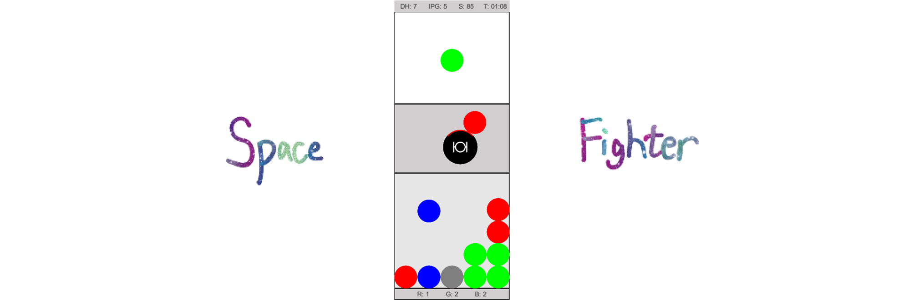
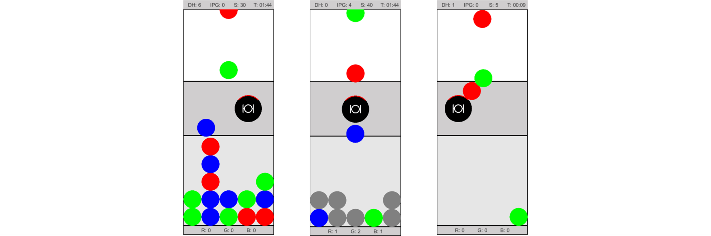

# Space Fighter

Match 3 game set in space

## 📚 Story

It's 3040 and you're in a space fighter, assigned with the job of allocating ionized space particles groups to power the international space station. Everything went well until you noticed that the upcoming ionized particles are mixed with some space debris...

## 🚀 The space fighter

Things are still under control! Your space fighter is equipped with a matter disintegrator at its front 1/4 which shatters space particles upon contact. Meanwhile, you can use the space fighter to push ionized particles to the desired slot of the storage area! Make sure to make use of the matter disintegrator to keep the storage area clean, and group the ionized space particles to power up the international space station.

## ⚪ The particles

__Red ionized particle__: Align 3 vertically to allocate a red ionized space particle group.
 
 
 
__Green ionized particle__: Align 3 vertically to allocate a green ionized space particle group.
 
 
 
__Blue ionized particle__: Align 3 vertically to allocate a blue ionized space particle group.
 
 
 
__Debris__: Don't let them fall into the storage area! Shatter them using the matter disintegrator equipped at the front of the space fighter.
 
 
 
Keep in mind that when more than three ionized particles are aligned, only the first three from the left/bottom will be allocated. However, if you managed to create a T-shaped match, you'll be able to allocate 5 ionized particles at once!

## 🎮 Controls

`↑`: Move the space fighter up

`↓`: Move the space fighter down

`←`: Move the space fighter left

`→`: Move the space fighter right

`Space`: Pause

## 👑 Win condition

You will win the game when you reach 100 points. The scoring formula can be found below:

| Description               | Score     |
| ------------------------- | --------- |
| Destroy a piece of debris | 5 points  |
| Match                     | 10 points |
| T-shaped match            | 30 points |

## 🩹 Game over condition

You will lose the game if you run into one of the following three situations, be cautious!

__Storage overflow__: A particle is stacked onto a full column.

__Dirty storage__: The storage area is filled with more than 5 debris.

__Space fighter destroyed__: two or more particles are overlaying on the space fighter.

  _Enjoy the ride!_
